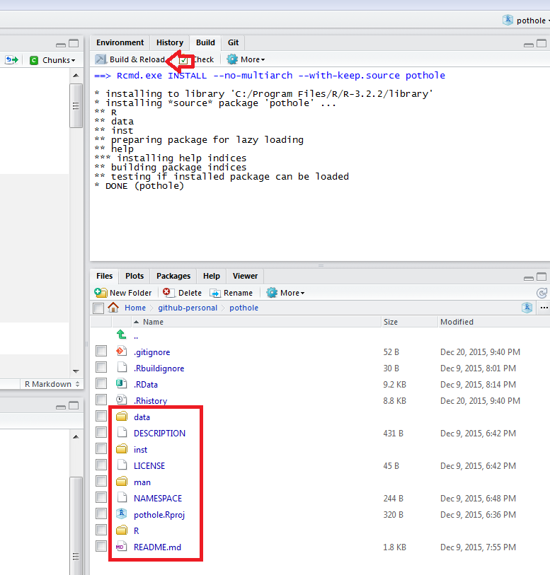

Using and Making APIs in R
========================================
author: Steve Mortimer
css: css-presentations.css


What is an API?
====================================================
type: subsection

<b><u>A</u></b>pplication <b><u>P</u></b>rogramming <b><u>I</u></b>nterface: 
<blockquote cite="https://en.wikipedia.org/wiki/Application_programming_interface">
expresses a software component in terms of its operations, inputs, outputs, and 
underlying types, defining functionalities that are independent of their 
respective implementations<sup>1</sup></blockquote>
* It's a contract between systems to facilitate a task 
<br><span style="font-size:65%;">(could be software, hardware, databases, web applications)</span>
* As Data Consumers we will focus on the specifications of webservice data API calls
<br>
<div class="footer">
<sup>1</sup>&nbsp;&nbsp;Wikipedia: <a href="https://en.wikipedia.org/wiki/Application_programming_interface">https://en.wikipedia.org/wiki/Application_programming_interface</a>
</div>

2 Common Webservice API Types
====================================

<div class="footer2">
<blockquote cite="">
<b>Resources:</b><br>
<a href="http://spf13.com/post/soap-vs-rest">The Difference Between SOAP and REST</a><br>
<a href="http://www.soapui.org/testing-dojo/world-of-api-testing/soap-vs--rest-challenges.html">SOAP vs REST Challenges</a>
</blockquote>
</div>

<div class="column column1 slideContent">
<span style="color:red">SOAP</span><br>
<span style="font-size:65%;"><b><u>S</u></b>imple <b><u>O</u></b>bject <b><u>A</u></b>ccess <b><u>P</u></b>rotocol</span> 
<ul>
<li>Protocol agnostic <br><span style="font-size:60%;">(HTTP, SMTP, TCP, or JMS)</span></li>
<li>Typically XML</li>
<li>Strongly Typed</li>
<li>Definitions provided by WSDL <span style="font-size:55%;">(<b><u>W</u></b>eb <b><u>S</u></b>ervice <b><u>D</u></b>escription <b><u>L</u></b>anguage)</span></li>
</ul>
</div><br>

<div class="column column2 slideContent">
<span style="color:red">REST</span><br>
<span style="font-size:65%;"><b><u>Re</u></b>presentational <b><u>S</u></b>tate <b><u>T</u></b>ransfer</span>
<ul>
<li>Noun-Verb Paradigm <br><span style="font-size:60%;">(HTTP GET/POST/PUT/DELETE)</span></li>
<li>Typically formatted as JSON <span style="font-size:55%;">(<b><u>J</u></b>ava<b><u>s</u></b>cript <b><u>O</u></b>bject <b><u>N</u></b>otation)</span></li>
</ul>
</div><br>


Diagramming SOAP vs. REST Services
====================================================
<div class="midcenter" style="margin-left:-410px; margin-top:-255px; width:103%;">
  
</div><br>
<div class="footer">
&nbsp;&nbsp;Image from: <a href="http://spf13.com/post/soap-vs-rest">http://spf13.com/post/soap-vs-rest</a>
</div>


2 Common API Data Formats
====================================
<span style="color:red">XML</span>

```
<person>
  <firstname>Rick</firstname>
  <lastname>James</lastname>
  <occupation>legend</occupation>
</person> 
```
<ul>
<li>Favored by SOAP APIs</li>
<li>Traditional format</li>
</ul>
***
<span style="color:red">JSON</span>

```
{
	"person" : {
		"firstname" : "Rick",
		"lastname" : "James",
		"occupation" : "legend"
	}
}
```
<ul>
<li>Favored by REST APIs</li>
<li>A more modern, flexible approach</li>
</ul>


transition-to-using-api
====================================================
title: false
<h3>
  <div class="midcenter" style="margin-left:-400px; margin-top:-300px;">
  </br></br></br><span style="font-weight: 700; color:#25679E;">Next: </span><br>Using APIs from R
  </div>
</h3>

Using an XML API
====================================
<div class="footer">
&nbsp;&nbsp;The Open Movie Database API at: <a href="http://www.omdbapi.com/">http://www.omdbapi.com/</a>
</div> 


```r
# Find a movie by title ("The Godfather")
library(XML);library(RCurl)
data <- RCurl::getURL(paste0('http://www.omdbapi.com/', 
                             '?t=The+Godfather&plot=short&r=xml'))
substring(data,1,250)
```

```
[1] "<?xml version=\"1.0\" encoding=\"UTF-8\"?><root response=\"True\"><movie title=\"The Godfather\" year=\"1972\" rated=\"R\" released=\"24 Mar 1972\" runtime=\"175 min\" genre=\"Crime, Drama\" director=\"Francis Ford Coppola\" writer=\"Mario Puzo (screenplay), Francis Ford"
```

```r
formatted_xml <- xmlParse(data)
xml_to_list <- xmlToList(formatted_xml)
head(xml_to_list$movie)
```

```
          title            year           rated        released 
"The Godfather"          "1972"             "R"   "24 Mar 1972" 
        runtime           genre 
      "175 min"  "Crime, Drama" 
```

Using an XML API with httr and xml2
====================================

```r
library(xml2);library(httr) # you could also use Hadley's packages
resp <- httr::GET(paste0('http://www.omdbapi.com/', 
                             '?t=The+Godfather&plot=short&r=xml'))
resp
```

```
Response [http://www.omdbapi.com/?t=The+Godfather&plot=short&r=xml]
  Date: 2016-01-22 05:05
  Status: 200
  Content-Type: text/xml; charset=utf-8
  Size: 796 B
```

```r
parsed_xml <- read_xml(content(resp, as="raw"))
parsed_xml
```

```
{xml_document}
<root>
[1] <movie title="The Godfather" year="1972" rated="R" released="24 Mar  ...
```

Using an XML API
====================================

```r
# Search all movies by a title ("The Godfather")
data <- getURL('http://www.omdbapi.com/?s=The+Godfather&r=xml')
formatted_xml <- xmlParse(data)
xmlAttrs(xmlChildren(formatted_xml)$root)
```

```
totalResults     response 
        "52"       "True" 
```

```r
# find all "result" elements
parsed_movie_elements <- xpathSApply(formatted_xml, "//result")
head(parsed_movie_elements, 2)
```

```
[[1]]
<result title="The Godfather" year="1972" imdbID="tt0068646" type="movie" poster="http://ia.media-imdb.com/images/M/MV5BMjEyMjcyNDI4MF5BMl5BanBnXkFtZTcwMDA5Mzg3OA@@._V1_SX300.jpg"/> 

[[2]]
<result title="The Godfather: Part II" year="1974" imdbID="tt0071562" type="movie" poster="http://ia.media-imdb.com/images/M/MV5BNDc2NTM3MzU1Nl5BMl5BanBnXkFtZTcwMTA5Mzg3OA@@._V1_SX300.jpg"/> 
```

Parsing XML to data.frame
====================================

```r
library(plyr)
xml_to_df <- ldply(parsed_movie_elements, .fun=function(x){
                t(as.data.frame(xmlToList(x)))
              }, .id=NULL)
head(xml_to_df[c('title', 'year', 'imdbID', 'type')])
```

```
                                  title year    imdbID   type
1                         The Godfather 1972 tt0068646  movie
2                The Godfather: Part II 1974 tt0071562  movie
3               The Godfather: Part III 1990 tt0099674  movie
4      The Godfather Trilogy: 1901-1980 1992 tt0150742  movie
5                         The Godfather 2006 tt0442674   game
6 The Godfather: A Novel for Television 1977 tt0809488 series
```

Using an JSON API
====================================

```r
library(rjson)
data <- getURL('http://www.omdbapi.com/?s=The+Godfather&r=json')
substring(data,1,250)
```

```
[1] "{\"Search\":[{\"Title\":\"The Godfather\",\"Year\":\"1972\",\"imdbID\":\"tt0068646\",\"Type\":\"movie\",\"Poster\":\"http://ia.media-imdb.com/images/M/MV5BMjEyMjcyNDI4MF5BMl5BanBnXkFtZTcwMDA5Mzg3OA@@._V1_SX300.jpg\"},{\"Title\":\"The Godfather: Part II\",\"Year\":\"1974\",\"imdbID"
```

```r
json_to_df <- ldply(rjson::fromJSON(data)$Search, function(x) as.data.frame(x))
head(json_to_df[c('Title', 'Year', 'imdbID', 'Type')])
```

```
                                  Title Year    imdbID   Type
1                         The Godfather 1972 tt0068646  movie
2                The Godfather: Part II 1974 tt0071562  movie
3               The Godfather: Part III 1990 tt0099674  movie
4      The Godfather Trilogy: 1901-1980 1992 tt0150742  movie
5                         The Godfather 2006 tt0442674   game
6 The Godfather: A Novel for Television 1977 tt0809488 series
```

transition-to-bulding-api
====================================================
title: false
<h3>
  <div class="midcenter" style="margin-left:-400px; margin-top:-300px;">
  </br></br></br><span style="font-weight: 700; color:#25679E;">Next: </span><br>Building an API with<br>R & OpenCPU
  </div>
</h3>

An Outline to Creating API with OpenCPU
====================================================
1. Build a Model
2. Write Scoring Logic
3. Save Model and Scoring Function by building as an R package
4. Push your code to Github
5. Add the OpenCPU Webhook to host your model as an API

Jump Start by Forking a Repo: https://github.com/ReportMort/pothole

Repo background: https://public.opencpu.org/ocpu/github/ReportMort/pothole/www/

Step 1: Build Model
====================================================
<div class="footer">
&nbsp;&nbsp;Full Script Available at: <a href="https://github.com/ReportMort/pothole/blob/master/inst/pothole/createmodel.R">https://github.com/ReportMort/pothole/blob/master/inst/pothole/createmodel.R</a>
</div> 

```r
options(stringsAsFactors=FALSE);library(forecast);library(rjson);library(lubridate)

# load historical data
json_data <- rjson::fromJSON(paste0('http://dashboard.edmonton.ca/',
                                    'resource/i3wp-57z9.json') 
formatted_data <- ldply(json_data, .fun = function(x) as.data.frame(x))
dat <- as.data.frame(lapply(formatted_data, function(x) type.convert(x, as.is=T)))
dat <- dat[order(dat$datetime),]

# convert to time series
dat$report_month <- match(gsub(' ', '', dat$report_month), month.name)
time_series <- ts(data=dat$number_of_potholes, 
                  start=c(head(dat$report_year,1), head(dat$report_month,1)), 
                  end=c(tail(dat$report_year,1), tail(dat$report_month,1)), 
                  frequency=12)

# build model
pothole_model <- ets(time_series, lambda=.0001)
pothole_data <- dat[,c('report_year', 'report_month', 'number_of_potholes')]
pothole_data$month_as_date <- as.Date(ymd(paste0(pothole_data$report_year,
                                             '-', pothole_data$report_month, 
                                             '-01'))))

# save models
save(file='./data/pothole_model.rda', list=c('pothole_model'))
save(file='./data/pothole_data.rda', list=c('pothole_data'))
```

Step 2: Write Scoring Logic
====================================================
<div class="footer">
&nbsp;&nbsp;Full Script Available at: <a href="https://github.com/ReportMort/pothole/blob/master/R/pothole_predict.R">https://github.com/ReportMort/pothole/blob/master/R/pothole_predict.R</a>
</div> 


```r
#' Potholes Filled Prediction Function
#' 
#' Simple ets model and the forecast function to predict potholes filled
#' 
#' @importFrom forecast forecast
#' @importFrom lubridate floor_date ymd %m+%
#' @importFrom zoo coredata
#' @param input data passed on as \code{h} to \code{\link{forecast}}
#' @examples
#' \dontrun{
#'    pothole_predict(data.frame(month='2016-01-01'))
#' }
#' @export
pothole_predict <- function(input){

  # load input data (can either be csv file or data.frame)
  newdat <- if(is.character(input) && file.exists(input)){
              read.csv(input, stringsAsFactors=FALSE)
            } else {
              as.data.frame(input, stringsAsFactors=FALSE)
            }

  ...
  
  fc <- forecast(pothole_model, h=months_to_forecast)
```

Step 3: Save Model as Package
====================================================
<div class="midcenter" style="margin-left:-410px; margin-top:-255px; width:103%;">

</div>

Step 4: Push Code to Github
====================================================

Step 5: Add OpenCPU Webhook
====================================================

Step 6: Try Out Your API
====================================================


Additional References
====================================================
type: subsection

* <a href="http://hilaryparker.com/2014/04/29/writing-an-r-package-from-scratch/">Building an R Package</a>

* <a href="https://www.opencpu.org">OpenCPU</a>
  * <a href="https://www.google.com/url?sa=t&rct=j&q=&esrc=s&source=web&cd=2&cad=rja&uact=8&ved=0ahUKEwiT47r-vrzKAhVG2R4KHT-WAroQjBAIJDAB&url=https%3A%2F%2Fwww.opencpu.org%2Fapps.html&usg=AFQjCNFieqdE9a1tvel0wBtDttQ_LdsLhw&sig2=pzJk9q7buvgj8X12yIa1aw">Example Apps</a>
  * <a href="https://www.opencpu.org/api.html#api-ci">Deploying on Public Server</a>
  * <a href="https://www.opencpu.org/api.html#api-json">Formatting JSON calls to the API</a>
  
* Deploying OpenCPU on Personal Server
  * <a href="https://www.virtualbox.org/wiki/Downloads">Downloading Virtualbox</a>
  * <a href="https://www.vagrantup.com/downloads.html">Vagrant Download</a>
  * <a href="https://github.com/mitchellh/vagrant-aws">Vagrant AWS Plugin</a>
  * <a href="https://www.google.com/url?sa=t&rct=j&q=&esrc=s&source=web&cd=5&cad=rja&uact=8&ved=0ahUKEwiT47r-vrzKAhVG2R4KHT-WAroQjBAIJjAE&url=https%3A%2F%2Fwww.opencpu.org%2Fdownload.html&usg=AFQjCNE6_UOD_BmO_pg48G-U7Armbo5MUw&sig2=oTt73nHH_K8lr1smIaeSsA">Instructions to Download and install</a>
  * <a href="http://jeroenooms.github.io/opencpu-manual/opencpu-server.pdf">Server Manual (helpful for self-hosting)</a>


